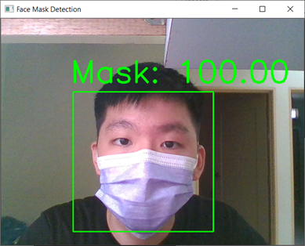
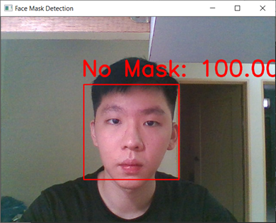

# surgical-face-mask-detection-system
This project is to create a simple surgical face mask detection system based on computer vision and deep learning using OpenCV and Tensorflow.

## How to Use
1. Clone this repository or download it as zip:

```https://github.com/shiyou99/surgical-face-mask-detection-system.git```

2. Run the detection program by using the code below

```python face_mask_webcam.py```

## Sample Output of Program
### With Mask

### Without Mask


## Limitations of the current project:
### * Facing difficulties in detecting faces with low light and low quality webcams.
### * Detection cannot work well while wearing glasses.
